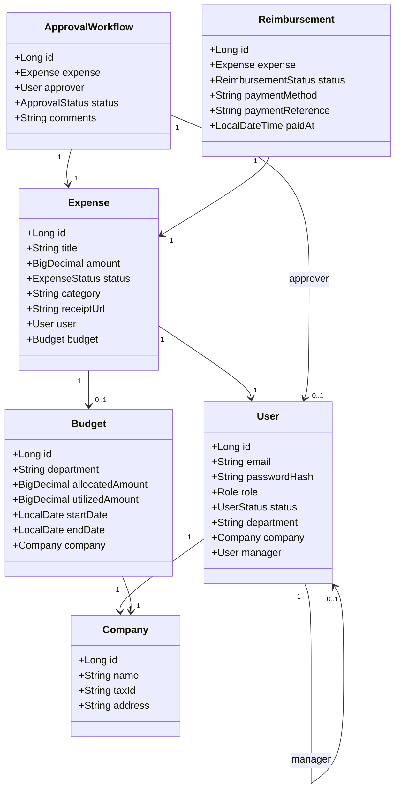

# 🪙 FinFlow AI

> **A Production-Grade Financial Operating System for Small and Medium Businesses (SMBs).**

[](https://spring.io/projects/spring-boot)
[](https://react.dev)
[](https://www.postgresql.org)
[](LICENSE)
[](#)

FinFlow AI is a high-performance, modular monolith designed to eliminate spend leaks, automate approval loops, track accounts payable, and secure organizational cash flows. Built on a robust Java (Spring Boot) and React architecture, it brings institutional-grade financial discipline to growing companies.

---

## 🚀 Key Features

*   **🏢 Multi-Tenant Isolation:** Register new corporate entities with dedicated database isolation, tax configurations (PAN), and isolated employee directories.
*   **👥 Role-Based Access Control (RBAC):** Granular security permissions across 5 built-in roles: `ADMIN`, `FINANCE_MANAGER`, `MANAGER`, `EMPLOYEE`, and `AUDITOR`.
*   **💰 Dynamic Departmental Budgets:** Allocate monthly or quarterly funds across departments (Engineering, Marketing, Sales, etc.). Enforces real-time checks to prevent budget overruns.
*   **💸 Intelligent Expense Routing & Workflows:**
    *   **Auto-Approval:** Claims `< 5,000 INR` are auto-approved instantly.
    *   **Manager Review:** Claims `5,000 - 25,000 INR` are routed to the employee’s direct manager.
    *   **Finance Pool:** Claims `> 25,000 INR` route to a finance-wide approval queue.
*   **🧾 Accounts Payable & Invoices:** Register invoices, link them to verified vendors, attach receipt files, and manage payables with custom status updates.
*   **💵 Reimbursement Settlement:** Track disbursement logs, payment reference IDs (e.g. UTR bank transfer numbers), and manage payouts.
*   **🛡️ Tamper-Evident Audit Trails:** Every critical mutation (budget updates, role changes, expense state toggles) is logged into an immutable database audit trail containing detailed before/after JSON diffs.
*   **📈 Glassmorphic Dashboards:** Interactive financial widgets and charting (using Recharts) representing monthly expenditures, category breakdowns, and budget consumption metrics.

---

# 🎬 Live Demo

<p align="center">
  <a href="https://youtu.be/Wt1oAPdlTS0?si=-P65SeXgEz-4C5Y3" target="_blank">
    
  </a>
</p>

<p align="center">
  <a href="https://youtu.be/Wt1oAPdlTS0?si=-P65SeXgEz-4C5Y3">
    
  </a>
</p>

<p align="center">
  <b>Click the image above or the button to watch the complete FinFlow AI demonstration.</b>
</p>

---

## 🧱 System Architecture

FinFlow AI is designed as a **Modular Monolith by Feature**, aligning perfectly with DDD (Domain-Driven Design) principles. Each business unit is fully contained within its own package boundary (e.g., `module/expense`, `module/budget`), ensuring a smooth future migration path to Microservices.

```
                                +-----------------------------+
                                |      React JS Frontend      |
                                |  (Vite, Tailwind, Motion)   |
                                +--------------+--------------+
                                               |
                                               | HTTP REST Calls (Port: 8080/api)
                                               v
+-----------------------------------------------------------------------------------------+
|                               Monolithic Spring Boot Backend                            |
|                                                                                         |
|  +-----------------------------------------------------------------------------------+  |
|  |                                  Web Controller Layer                             |  |
|  |           - Exposes JSON REST Endpoints                                           |  |
|  |           - Security Filter Chain & Method-Level Role Guards (@PreAuthorize)      |  |
|  |           - Global Exception Handler (@RestControllerAdvice)                      |  |
|  +------------------------------------------+----------------------------------------+  |
|                                             |                                           |
|                                             v                                           |
|  +-----------------------------------------------------------------------------------+  |
|  |                                      Service Layer                                |  |
|  |           - Encapsulates Business Workflows (Approval Engine, Budget Checks)       |  |
|  |           - Declares Transaction Boundaries (@Transactional)                      |  |
|  |           - Emits audit entries to AuditLogService                                |  |
|  +------------------------------------------+----------------------------------------+  |
|                                             |                                           |
|                                             v                                           |
|  +-----------------------------------------------------------------------------------+  |
|  |                                    Data Access Layer                              |  |
|  |           - Hibernate Object-Relational Mappings (ORM)                            |  |
|  |           - JPA Repositories (declarative JPQL queries)                           |  |
|  +-----------------------------------------------------------------------------------+  |
+-----------------------------------------------------+-----------------------------------+
                                                      |
                                                      | JDBC SQL Connection
                                                      v
                                       +--------------+--------------+
                                       |      PostgreSQL Database    |
                                       |      (ACID Transactions)    |
                                       +-----------------------------+
```

---

## 🛠️ Technology Stack

| Component | Technology | Description |
| :--- | :--- | :--- |
| **Frontend Core** | React 18 / Vite | Lightning-fast component rendering and hot-module reloading. |
| **Styling** | Tailwind CSS / Framer Motion | Glassmorphism, smooth animations, responsive flexboxes. |
| **Backend Core** | Spring Boot 3.x / Java 21 | Enterprise-grade core monolithic runtime framework. |
| **Security** | Spring Security 6 / JWT | Stateless authentication with access and refresh token tokens. |
| **Database** | PostgreSQL 16 | ACID-compliant relation repository. |
| **ORM** | Spring Data JPA / Hibernate | High-performance SQL abstraction and custom repository queries. |
| **Serialization** | MapStruct / Jackson | Optimized DTO mapping layer preventing entity leaks. |

---

## 🗄️ Database Domain Model



---

## ⚙️ Getting Started

### Prerequisites
*   Java Development Kit (JDK) 17 or 21
*   Node.js (v18 or above) & npm
*   PostgreSQL Database instance

### 1. Database Configuration
1. Create a database named `finflow_db` in PostgreSQL.
2. Open [application.yml](file:///c:/6th%20sem/Full%20Stack/PROJECT/Finflow%20AI/backend/src/main/resources/application.yml) and configure your datasource connection settings:
   ```yaml
   spring:
     datasource:
       url: jdbc:postgresql://localhost:5432/finflow_db
       username: <your_username>
       password: <your_password>
   ```

### 2. Backend Setup
1. Navigate to the backend directory:
   ```bash
   cd backend
   ```
2. Compile and run the application:
   ```bash
   mvn clean spring-boot:run
   ```
   The backend API service will initialize on port `8080`.

### 3. Frontend Setup
1. Navigate to the frontend directory:
   ```bash
   cd frontend
   ```
2. Install npm dependencies:
   ```bash
   npm install
   ```
3. Boot up the Vite local server:
   ```bash
   npm run dev
   ```
   Open [http://localhost:5173](http://localhost:5173) in your browser to view the application.

---

## 🔑 Demo Credentials (Seed Accounts)

The database is preseeded with standard demonstration accounts for Acme Corporation. Log in with the email addresses below using the password **`password123`**:

| Role | Email Address | Access Profile & Actions |
| :--- | :--- | :--- |
| **Admin** | `admin@acme.com` | Access to User Directory, Status Activations, and Budgets. |
| **Manager** | `manager@acme.com` | Approves routed claims (5,000 - 25,000 INR) assigned to them. |
| **Finance Manager** | `finance@acme.com` | Approves high-value claims (>25,000 INR), records settlements. |
| **Auditor** | `auditor@acme.com` | Read-only view of dashboard and historical audit change logs. |
| **Employee** | `employee@acme.com` | Submits claims, uploads documents, view dashboard analytics. |

---

## 🔮 Future Roadmap

*   **⚡ Asynchronous Audit Pipeline:** Decouple Audit logging into a standalone message queue using **Apache Kafka** to prevent log blocks during heavy transaction operations.
*   **🚀 Redis Memory Cache Layer:** Implement cache policies for active budgets, session authentication tokens, and department allocations.
*   **🐋 Container Orchestration:** Production-ready Multi-Stage Docker builds with Docker Compose configs.
*   **🌐 Microservices Extraction:** Extraction of modular monolithic domains (`user-service`, `expense-service`, `payout-service`) into isolated spring-cloud runtimes.
