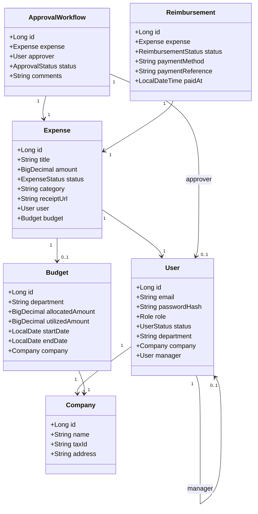

# 🪙 FinFlow AI

> **A Production-Grade Financial Operating System for Small and Medium Businesses (SMBs).**

[](https://spring.io/projects/spring-boot)
[](https://react.dev)
[](https://www.postgresql.org)
[](https://www.h2database.com)
[](https://junit.org/junit5/)
[](LICENSE)
[](#)

FinFlow AI is a high-performance, modular monolith designed to eliminate spend leaks, automate approval loops, track accounts payable, and secure organizational cash flows. Built on a robust Java (Spring Boot 3) and React architecture, it brings institutional-grade financial discipline to growing companies.

---

## 🚀 Key Features

*   **🏢 Multi-Tenant Isolation:** Register new corporate entities with dedicated database isolation, tax configurations (PAN), and isolated employee directories.
*   **👥 Role-Based Access Control (RBAC):** Granular security permissions across 5 built-in roles: `ADMIN`, `FINANCE_MANAGER`, `MANAGER`, `EMPLOYEE`, and `AUDITOR`.
*   **💰 Dynamic Departmental Budgets:** Allocate monthly or quarterly funds across departments (Engineering, Marketing, Sales, etc.). Enforces real-time checks to prevent budget overruns.
*   **💸 Intelligent Multi-Tier Expense Routing:**
    *   **Tier 1 (< 5,000 INR):** Auto-approved instantly with automated reimbursement claim generation.
    *   **Tier 2 (5,000 - 25,000 INR):** Routed to employee's direct line manager for review.
    *   **Tier 3 (> 25,000 INR):** Routed to the company-wide Finance Manager review pool.
*   **🧾 Accounts Payable & Invoices:** Register invoices, link them to verified vendors, attach receipt files, and manage payables with automatic overdue calculation.
*   **💵 Reimbursement Settlement:** Track disbursement logs, record settlement payment references (UTR / Bank transfer IDs), and manage payouts.
*   **🛡️ Tamper-Evident Audit Trails:** Every critical mutation (budget updates, role changes, expense state toggles) is logged into an immutable database audit trail containing before/after diffs.
*   **📈 Glassmorphic Dashboards:** Interactive financial widgets and charting (using Recharts) representing monthly expenditures, category breakdowns, and budget consumption metrics.

---

# 🎬 Live Demo

<p align="center">
  <a href="https://youtu.be/Wt1oAPdlTS0?si=-P65SeXgEz-4C5Y3" target="_blank">
    
  </a>
</p>

<p align="center">
  <a href="https://youtu.be/Wt1oAPdlTS0?si=-P65SeXgEz-4C5Y3">
    
  </a>
</p>

<p align="center">
  <b>Click the image above or the button to watch the complete FinFlow AI demonstration.</b>
</p>

---

## 🧱 System Architecture

FinFlow AI is designed as a **Modular Monolith by Feature**, aligning with Domain-Driven Design (DDD) principles. Each business unit is fully contained within its own package boundary (`module/auth`, `module/expense`, `module/budget`, `module/approval`, `module/reimbursement`, `module/invoice`, `module/vendor`, `module/user`, `module/company`).

```
                                +-----------------------------+
                                |      React JS Frontend      |
                                |  (Vite, Tailwind, Motion)   |
                                +--------------+--------------+
                                               |
                                               | HTTP REST Calls (Port: 8080/api)
                                               v
+-----------------------------------------------------------------------------------------+
|                               Monolithic Spring Boot Backend                            |
|                                                                                         |
|  +-----------------------------------------------------------------------------------+  |
|  |                                  Web Controller Layer                             |  |
|  |           - Exposes JSON REST Endpoints under /api                                |  |
|  |           - Security Filter Chain & Method-Level Role Guards (@PreAuthorize)      |  |
|  |           - Standardized Envelope Format (ApiResponse<T>)                         |  |
|  |           - Global Exception Handler (@RestControllerAdvice)                      |  |
|  +------------------------------------------+----------------------------------------+  |
|                                             |                                           |
|                                             v                                           |
|  +-----------------------------------------------------------------------------------+  |
|  |                                      Service Layer                                |  |
|  |           - Encapsulates Business Workflows (Approval Engine, Budget Checks)       |  |
|  |           - Transaction Management (@Transactional)                               |  |
|  |           - Audit Log Interception (AuditLogService)                              |  |
|  +------------------------------------------+----------------------------------------+  |
|                                             |                                           |
|                                             v                                           |
|  +-----------------------------------------------------------------------------------+  |
|  |                                    Data Access Layer                              |  |
|  |           - Hibernate Object-Relational Mappings (ORM)                            |  |
|  |           - JPA Repositories with custom JPQL queries                             |  |
|  +-----------------------------------------------------------------------------------+  |
+-----------------------------------------------------+-----------------------------------+
                                                      |
                                                      | JDBC SQL Connection
                                                      v
                                       +--------------+--------------+
                                       |      PostgreSQL Database    |
                                       |      (ACID Transactions)    |
                                       +-----------------------------+
```

---

## 🛠️ Technology Stack

| Layer | Technology | Purpose |
| :--- | :--- | :--- |
| **Frontend Core** | React 19 + Vite | Component rendering, hooks, and fast HMR development. |
| **Styling & UI** | Tailwind CSS v4 + Framer Motion | Glassmorphism, modern typography, micro-animations. |
| **Backend Core** | Spring Boot 3.4.0 + Java 21 | High-throughput monolithic REST API. |
| **Security** | Spring Security 6 + JJWT (0.12.3) | Stateless authentication, Access & Refresh token rotation. |
| **Database** | PostgreSQL 16 (Prod) / H2 (Test) | Relational persistence & zero-dependency isolated in-memory test database. |
| **ORM & Mapping** | Spring Data JPA / Hibernate / MapStruct | Type-safe persistence and performant DTO mappings. |
| **Testing** | JUnit 5 + Mockito + MockMvc + AssertJ | Comprehensive unit and integration test coverage. |
| **API Docs** | SpringDoc OpenAPI 3 / Swagger UI | Interactive API documentation. |

---

## 🧪 Testing Architecture

FinFlow AI includes an automated testing suite comprising **Unit Tests** and **Integration Tests** executed with Maven and JUnit 5.

```
backend/src/test/
├── java/com/finflow/ai/
│   ├── security/
│   │   └── JwtTokenProviderTest.java              # Unit: JWT generation, claims & validation
│   ├── module/
│   │   ├── auth/AuthServiceImplTest.java          # Unit: Registration, login & refresh
│   │   ├── expense/ExpenseServiceImplTest.java    # Unit: 3-tier expense routing & budget checks
│   │   ├── approval/ApprovalServiceImplTest.java  # Unit: Manager & Finance approval workflows
│   │   ├── budget/BudgetServiceImplTest.java      # Unit: Overlap checks & limit validation
│   │   ├── user/UserServiceImplTest.java          # Unit: Invitation, activation & RBAC
│   │   ├── company/CompanyServiceImplTest.java    # Unit: Company profiles & updates
│   │   ├── vendor/VendorServiceImplTest.java      # Unit: Vendor lifecycle & invoice guards
│   │   ├── invoice/InvoiceServiceImplTest.java    # Unit: Invoices & overdue calculations
│   │   └── reimbursement/ReimbursementServiceImplTest.java # Unit: Payouts & status lifecycle
│   └── integration/
│       ├── AuthControllerIntegrationTest.java     # Integration: Live Auth HTTP REST flows
│       ├── ExpenseFlowIntegrationTest.java        # Integration: End-to-end multi-tier expense lifecycle
│       ├── BudgetControllerIntegrationTest.java   # Integration: Budget endpoints & overlap validation
│       └── VendorAndInvoiceIntegrationTest.java   # Integration: Vendor creation & invoice settlement
└── resources/
    └── application-test.yml                       # In-memory H2 PostgreSQL mode for test isolation
```

### Running Tests

To run the complete test suite:
```powershell
cd backend
mvn test
```

To run a specific test class:
```powershell
mvn test -Dtest=ExpenseFlowIntegrationTest
```

---

## 🗄️ Database Domain Model


```mermaid
classDiagram
    class Company {
        +Long id
        +String name
        +String taxId
        +String address
    }
    class User {
        +Long id
        +String email
        +String passwordHash
        +Role role
        +UserStatus status
        +String department
        +Company company
        +User manager
    }
    class Budget {
        +Long id
        +String department
        +BigDecimal allocatedAmount
        +BigDecimal utilizedAmount
        +LocalDate startDate
        +LocalDate endDate
        +Company company
    }
    class Expense {
        +Long id
        +String title
        +BigDecimal amount
        +ExpenseStatus status
        +String category
        +String receiptUrl
        +User user
        +Budget budget
    }
    class ApprovalWorkflow {
        +Long id
        +Expense expense
        +User approver
        +ApprovalStatus status
        +String comments
    }
    class Reimbursement {
        +Long id
        +Expense expense
        +ReimbursementStatus status
        +String paymentMethod
        +String paymentReference
        +LocalDateTime paidAt
    }
    
    User "1" --> "1" Company
    User "1" --> "0..1" User : manager
    Budget "1" --> "1" Company
    Expense "1" --> "1" User
    Expense "1" --> "0..1" Budget
    ApprovalWorkflow "1" --> "1" Expense
    ApprovalWorkflow "1" --> "0..1" User : approver
    Reimbursement "1" --> "1" Expense
```

---

## ⚙️ Getting Started

### Prerequisites
*   **Java Development Kit (JDK):** 21 (or 17+)
*   **Apache Maven:** 3.9+
*   **Node.js:** v18+ & npm
*   **PostgreSQL Database:** v14+ (or use cloud PostgreSQL like Neon)

---

### 1. Database Configuration
1. Create a database named `finflow_db` in PostgreSQL.
2. Configure your connection settings in [application.yml](file:///c:/6th%20sem/Full%20Stack/PROJECT/Finflow%20AI/backend/src/main/resources/application.yml) or via environment variables:
   ```yaml
   spring:
     datasource:
       url: ${SPRING_DATASOURCE_URL:jdbc:postgresql://localhost:5432/finflow_db}
       username: ${SPRING_DATASOURCE_USERNAME:postgres}
       password: ${SPRING_DATASOURCE_PASSWORD:postgres}
   ```

---

### 2. Backend Setup
1. Navigate to the backend directory:
   ```powershell
   cd backend
   ```
2. Build and run all unit & integration tests:
   ```powershell
   mvn test
   ```
3. Start the Spring Boot application:
   ```powershell
   mvn spring-boot:run
   ```
   * The backend server will start on port `8080` (context path `/api`).
   * Interactive Swagger UI docs: [http://localhost:8080/api/swagger-ui/index.html](http://localhost:8080/api/swagger-ui/index.html)

---

### 3. Frontend Setup
1. Navigate to the frontend directory:
   ```powershell
   cd frontend
   ```
2. Install npm dependencies:
   ```powershell
   npm install
   ```
3. Start the Vite development server:
   ```powershell
   npm run dev
   ```
4. Open [http://localhost:5173](http://localhost:5173) in your browser.

---

## 🔑 Demo Credentials (Seed Accounts)

The application automatically seeds a demo organization (**Acme Corporation**) on initial startup. You can authenticate using password **`password123`**:

| Role | Email Address | Permissions & Features Accessible |
| :--- | :--- | :--- |
| **Admin** | `admin@acme.com` | User invitation, account activation, company settings & budget creation. |
| **Manager** | `manager@acme.com` | Reviews and approves routed departmental claims (5,000 – 25,000 INR). |
| **Finance Manager** | `finance@acme.com` | Approves high-value claims (>25,000 INR) & records reimbursement payouts. |
| **Auditor** | `auditor@acme.com` | Read-only access to immutable change logs and financial audit trails. |
| **Employee** | `employee@acme.com` | Submits expense claims with receipts and tracks reimbursement progress. |

---

## 📄 License
This project is licensed under the [MIT License](LICENSE).
