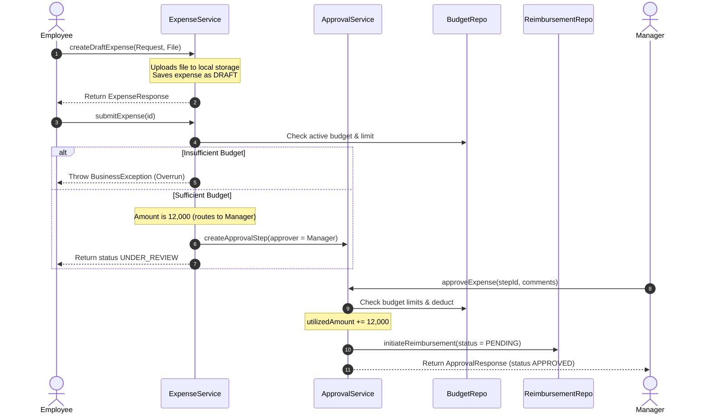
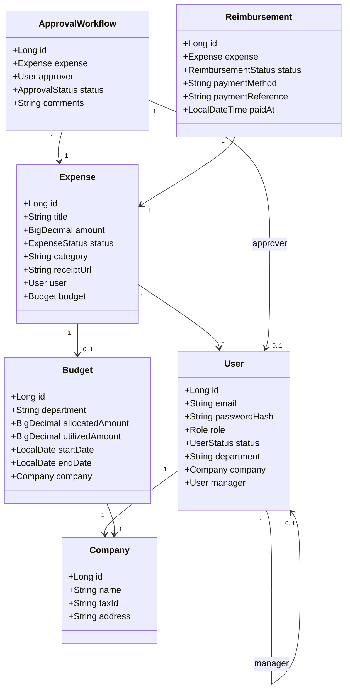

# FINFLOW_AI_MASTER_DOCUMENT.md

## Financial Operating System for SMBs (Monolith - Phase 1)

---

### 1. Project Vision
FinFlow AI is designed as a secure, production-grade financial operating system for Small and Medium Businesses (SMBs). It consolidates expense filing, hierarchy-based approval workflows, accounts payable invoice tracking, departmental budget allocations, and disbursement payouts into a single, cohesive modular monolith. By providing total cash flow transparency, it eliminates manual reconciliation, prevents budget overruns, and secures company resources via robust role-based access controls.

---

### 2. Business Problem
SMBs face massive leaks due to:
* **Uncontrolled Spending**: Employees filing claims that exceed department limits.
* **Operational Bottlenecks**: Manual paper approvals and routing delays for employee reimbursements.
* **Lack of Audit Trails**: No record of who changed expense states, modified budgets, or approved payments.
* **Invoice Tracking Gaps**: Missed due dates for vendor invoices leading to late fees or supply chain interruptions.
* **Role Blurring**: Employees, managers, and finance officers exercising overlapping privileges without segregation.

---

### 3. Feature Breakdown
* **Auth**: Register company, login, renew sessions with JWT refresh tokens, change password, simulation of password recovery.
* **Company**: Create/modify company profiles, set PAN/Tax IDs.
* **User/RBAC**: Invite employees, update user status (Active/Inactive), assign roles (ADMIN, FINANCE_MANAGER, MANAGER, EMPLOYEE, AUDITOR), company directory search.
* **Budgets**: Set departmental funding allocations, real-time progress indicators, block approvals if overdrawn.
* **Vendors**: Contact records database, invoices referential integrity blocker.
* **Invoices**: Record accounts payable bills with PDF attachments, track due dates, mark as paid.
* **Expenses**: Create drafts, upload receipt documents, submit claims, automatically trigger workflow checks.
* **Workflow Engine**: Claims < 5k auto-approve; 5k to 25k route to manager; > 25k route to finance manager pool.
* **Reimbursements**: Generate disbursements on approval, record payout reference IDs, settle claims.
* **Audit Trail**: Tabular history showing timestamp, operator, action type, and before/after values as JSON diffs.
* **Dashboards**: Summaries of metrics, Recharts trends, budget charts.

---

### 4. System Architecture

```
                               +-----------------------------+
                               |     React JS Frontend       |
                               | (Vite, Tailwind v4, Motion) |
                               +--------------+--------------+
                                              |
                                              | HTTP REST Calls (Port: 8080/api)
                                              v
+-----------------------------------------------------------------------------------------+
|                               Monolithic Spring Boot Backend                            |
|                                                                                         |
|  +-----------------------------------------------------------------------------------+  |
|  |                                  Web Controller Layer                             |  |
|  |           - Exposes JSON REST Endpoints                                           |  |
|  |           - Security Filter Chain & Method-Level Role Guards (@PreAuthorize)      |  |
|  |           - Global Exception Handler (@RestControllerAdvice)                      |  |
|  +------------------------------------------+----------------------------------------+  |
|                                             |                                           |
|                                             v                                           |
|  +-----------------------------------------------------------------------------------+  |
|  |                                      Service Layer                                |  |
|  |           - Encapsulates Business Workflows (Approval Engine, Budget Checks)       |  |
|  |           - Declares Transaction Boundaries (@Transactional)                      |  |
|  |           - Emits audit entries to AuditLogService                                |  |
|  +------------------------------------------+----------------------------------------+  |
|                                             |                                           |
|                                             v                                           |
|  +-----------------------------------------------------------------------------------+  |
|  |                                    Data Access Layer                              |  |
|  |           - Hibernate Object-Relational Mappings (ORM)                            |  |
|  |           - JPA Repositories (declarative JPQL queries)                           |  |
|  +-----------------------------------------------------------------------------------+  |
+-----------------------------------------------------+-----------------------------------+
                                                      |
                                                      | JDBC SQL Connection
                                                      v
                                       +--------------+--------------+
                                       |      PostgreSQL Database    |
                                       |      (ACID Transactions)    |
                                       +-----------------------------+
```

---

### 5. Folder Structure

```
Finflow AI/
├── backend/
│   ├── pom.xml                        # Dependencies & Compile configuration
│   └── src/main/java/com/finflow/ai/
│       ├── FinflowAiApplication.java  # Main Boot file & JPA auditing enable
│       ├── config/                    # Security, CORS, Web, OpenApi Configurations
│       ├── common/                    # ApiResponse envelopes, Storage Abstraction
│       ├── exception/                 # Custom Exception definitions & Global Handler
│       ├── security/                  # JWT token engine, filters, UserPrincipal
│       └── module/                    # Self-contained modules (Readiness for microservices)
│           ├── company/
│           ├── user/
│           ├── budget/
│           ├── vendor/
│           ├── invoice/
│           ├── expense/
│           ├── approval/
│           ├── reimbursement/
│           ├── dashboard/
│           ├── analytics/
│           └── auditlog/
└── frontend/
    ├── package.json                   # React packages
    ├── vite.config.js                 # Proxy mappings & Tailwind config integration
    └── src/
        ├── index.css                  # Tailwind imports, Custom Glassmorphism styles
        ├── main.jsx                   # React DOM render mount
        ├── App.jsx                    # Client routes & ProtectedRoute Guards
        ├── components/                # Sidebar, Navbar, Badge, GlassCard, Modal
        ├── context/                   # AuthContext for session management
        ├── services/                  # api.js client (Axios concurrent request queues)
        └── pages/                     # Page views (Dashboard, Expenses, Invoices, etc.)
```

---

### 6. Backend Layered Architecture
*   **Controller Layer**: Receives HTTP inputs, validates parameters using Jakarta `@Valid`, checks role-based access via `@PreAuthorize`, and maps incoming records to clean output payloads using MapStruct.
*   **Service Layer**: Represents the transactional engine. Evaluates business conditions (such as date range overlaps, budget limitations, and matrix approval values) and manages entity updates.
*   **Repository Layer**: Extends `JpaRepository` to perform CRUD queries on the database. It wraps transaction actions and locks records when necessary to prevent concurrency race conditions.

---

### 7. Frontend Architecture
*   **Routing**: Utilizes `react-router-dom` to enforce routing. The custom `<ProtectedRoute>` guard evaluates the user session, intercepts unauthorized requests, and validates role permissions on client pages.
*   **Context API**: Exposes `AuthContext` to share user metadata, login handles, and role evaluations across components.
*   **Service client**: Centralized in `api.js`. Resolves session renewal via a custom response interceptor.
*   **Aesthetics**: Glassmorphic panels, glowing text badges, hover transitions, and customized scrollbars matching Notion and Stripe premium UI dashboards.

---

### 8. Database Design

```
+---------------------------------------------------------------------------------------------------------------------+
|                                                  DATABASE DIAGRAM                                                   |
+---------------------------------------------------------------------------------------------------------------------+
|                                                                                                                     |
|   +-------------------+              +-------------------------+              +------------------------+            |
|   |     companies     |              |          users          |              |        budgets         |            |
|   +-------------------+              +-------------------------+              +------------------------+            |
|   | pk | id           |<----+        | pk | id                 |<----+        | pk | id                |            |
|   |    | name         |     |        |    | email (unique)     |     |        |    | department        |            |
|   |    | tax_id       |     |        |    | password_hash      |     |        |    | allocated_amount  |            |
|   |    | address      |     |        |    | first_name         |     |        |    | utilized_amount   |            |
|   |    | created_at   |     |        |    | last_name          |     +------- | fk | company_id        |            |
|   |    | updated_at   |     |        |    | role               |     |        |    | start_date        |            |
|   +-------------------+     |        |    | status             |     |        |    | end_date          |            |
|                             |        |    | department         |     |        |    | created_at        |            |
|                             +------- | fk | company_id         |     |        |    | updated_at        |            |
|                             |        | fk | manager_id         |-----+        +------------------------+            |
|                             |        |    | created_at         |                                                    |
|                             |        |    | updated_at         |                                                    |
|                             |        +-------------------------+                                                    |
|                             |                     |                                                                 |
|                             |                     +----------------------------------------+                        |
|                             |                                                              v                        |
|   +-------------------+     |                                                  +-----------------------+            |
|   |      vendors      |     |                                                  |       expenses        |            |
|   +-------------------+     |                                                  +-----------------------+            |
|   | pk | id           |     |                                                  | pk | id               |<-----+     |
|   |    | name         |     |                                                  |    | title            |      |     |
|   |    | email        |     |                                                  |    | amount           |      |     |
|   |    | phone        |     |                                                  |    | description      |      |     |
|   |    | address      |     |                                                  |    | status           |      |     |
|   | fk | company_id   |-----+                                                  |    | category         |      |     |
|   |    | created_at   |                                                        |    | receipt_url      |      |     |
|   |    | updated_at   |                                                        | fk | user_id          |      |     |
|   +-------------------+                                                        | fk | budget_id        |      |     |
|             |                                                                  |    | created_at       |      |     |
|             v                                                                  |    | updated_at       |      |     |
|   +-------------------+                                                        +-----------------------+      |     |
|   |     invoices      |                                                                    |                  |     |
|   +-------------------+                                                                    |                  |     |
|   | pk | id           |                                                                    v                  |     |
|   |    | invoice_num  |                                                        +-----------------------+      |     |
|   |    | amount       |                                                        |  approval_workflows   |      |     |
|   |    | due_date     |                                                        +-----------------------+      |     |
|   |    | status       |                                                        | pk | id               |      |     |
|   |    | file_url     |                                                        | fk | expense_id       |------+     |
|   | fk | vendor_id    |                                                        | fk | approver_id      |            |
|   | fk | company_id   |                                                        |    | status           |            |
|   |    | created_at   |                                                        |    | comments         |            |
|   |    | updated_at   |                                                        |    | created_at       |            |
|   +-------------------+                                                        |    | updated_at       |            |
|                                                                                +-----------------------+            |
|                                                                                            |                        |
|   +----------------------------------------------------------------------------------------+                        |
|   v                                                                                                                 |
|   +-------------------+                                                        +-----------------------+            |
|   |    audit_logs     |                                                        |    reimbursements     |            |
|   +-------------------+                                                        +-----------------------+            |
|   | pk | id           |                                                        | pk | id               |            |
|   |    | user_email   |                                                        | fk | expense_id       |------------+
|   |    | action       |                                                        |    | status           |            |
|   |    | entity_type  |                                                        |    | payment_method   |            |
|   |    | entity_id    |                                                        |    | payment_reference|            |
|   |    | old_value    |                                                        |    | paid_at          |            |
|   |    | new_value    |                                                        |    | created_at       |            |
|   |    | timestamp    |                                                        |    | updated_at       |            |
|   +-------------------+                                                        +-----------------------+            |
|                                                                                                                     |
+---------------------------------------------------------------------------------------------------------------------+
```

---

### 9. Entity-Relationship Details
*   `companies` to `users` (**1:N**): A company employs many users; users belong to one company.
*   `users` to `expenses` (**1:N**): An employee files multiple expense claims.
*   `budgets` to `expenses` (**1:N**): A budget funds many expenses; an expense is linked to a single department budget.
*   `users` to `users` (**1:N** self-reference): Captures direct hierarchy. Employees point to their manager's user record for routing approvals.
*   `expenses` to `approval_workflows` (**1:N**): An expense tracks audit logs of approval steps.
*   `expenses` to `reimbursements` (**1:1**): An approved expense triggers a single reimbursement payout record.
*   `vendors` to `invoices` (**1:N**): A vendor issues many accounts payable invoices.

---

### 10. Complete Entity Explanation
*   `User`: Holds account metadata, email, and password hash. Contains custom JPA Enum mappings for `Role` and `UserStatus`.
*   `Company`: Represents the organization entity.
*   `Budget`: Departments allocate money and track utilization. Checks overlapping ranges.
*   `Expense`: Captures the claim, amount, receipt attachments, and tracks status.
*   `ApprovalWorkflow`: Workflow nodes checking if steps are PENDING, APPROVED, or REJECTED.
*   `Reimbursement`: Payout logs tracking UTR references and payment types (ACH, Bank Transfer).
*   `Invoice`: Accounts payable entries representing supplier claims.
*   `AuditLog`: Independent trail logging exact JSON diffs.

---

### 11. DTO (Data Transfer Object) Design Pattern
Entities are linked to active Hibernate sessions. Exposing entities directly at the REST controller:
1. Causes **lazy initialization exceptions** when accessing un-fetched relations.
2. Exposes secret fields (like `passwordHash`).
3. Creates tight coupling between API contracts and database schema.

**FinFlow AI** uses MapStruct to map DTOs:
*   `RegisterRequest` / `LoginRequest` / `LoginResponse`
*   `UserResponse` / `InviteEmployeeRequest`
*   `ExpenseRequest` / `ExpenseResponse`
*   `InvoiceRequest` / `InvoiceResponse`
*   `ReimbursementPaymentRequest` / `ReimbursementResponse`
*   `ApprovalRequest` / `ApprovalResponse`

---

### 12. Controller Explanation
Controllers act as HTTP gates:
*   `AuthController`: Manages stateless auth endpoints.
*   `UserController`: Handles user directory lookups and invitations, protecting toggle status and roles.
*   `ExpenseController`: Handles claims, draft updates, and submits.
*   `ApprovalController`: Allows managers to review and resolve workflows.
*   `ReimbursementController`: Allows finance officers to record payout clearing.
*   `BudgetController` / `VendorController` / `InvoiceController`: Manage department allocations, supplier logs, and bill payments.

---

### 13. Service Layer Design Pattern
Service classes run inside transaction blocks. The **Facade Design Pattern** is used: controllers call the service interface (`ExpenseService`) which coordinates with repositories, storage systems, audit log loggers, and workflow engines. This keeps controllers light and business logic modular.

---

### 14. Repository (DAO) Explanation
Repositories extend `JpaRepository` to abstract SQL execution. We use:
*   **JPQL Custom Queries**: E.g., `BudgetRepository.findActiveBudget` checks if a specific date falls within a department's budget timeline (`:date BETWEEN b.startDate AND b.endDate`).
*   **Reference Integrity Checkers**: E.g., `InvoiceRepository.existsByVendorId` prevents vendor deletion if unresolved invoices exist.

---

### 15. Standardized API Documentation

*   `POST /api/auth/register` (Public) - Body: `RegisterRequest` -> Response: `ApiResponse<UserResponse>`
*   `POST /api/auth/login` (Public) - Body: `LoginRequest` -> Response: `ApiResponse<LoginResponse>` (Returns Access & Refresh Token)
*   `POST /api/auth/refresh` (Public) - Body: `RefreshTokenRequest` -> Response: `ApiResponse<LoginResponse>`
*   `POST /api/users/invite` (Role: ADMIN, FINANCE_MANAGER) - Body: `InviteEmployeeRequest` -> Response: `ApiResponse<UserResponse>`
*   `POST /api/expenses` (Authenticated, multipart/form-data) - Parts: `expense` (JSON), `file` (MultipartFile) -> Response: `ApiResponse<ExpenseResponse>`
*   `POST /api/expenses/{id}/submit` (Owner only) -> Response: `ApiResponse<ExpenseResponse>`
*   `PATCH /api/approvals/{id}/approve` (Role: MANAGER, FINANCE_MANAGER) - Body: `ApprovalRequest` -> Response: `ApiResponse<ApprovalResponse>`
*   `PATCH /api/reimbursements/{id}/pay` (Role: FINANCE_MANAGER) - Body: `ReimbursementPaymentRequest` -> Response: `ApiResponse<ReimbursementResponse>`

---

### 16. Authentication Flow
```
Client                      Controller                 Filter / TokenProvider               Database
  |                             |                               |                              |
  |--- POST /auth/login ------->|                               |                              |
  |    (email, password)        |--- Authenticate Credentials ->|                              |
  |                             |    (DaoAuthenticationProvider)|--- LoadUserDetails --------->|
  |                             |<-- Authentication Success ----|<-- Return Hash & Status -----|
  |                             |--- Generate Tokens ---------->|                              |
  |                             |    (Generate Access & Refresh)|                              |
  |                             |<-- Sign & Return JWTs --------|                              |
  |<-- Return LoginResponse ----|                               |                              |
```

---

### 17. Authorization Flow
1. **JWT Inspection Filter**: Intercepts requests, reads the Bearer token, and extracts the username and roles.
2. **Security Context**: Sets a `UsernamePasswordAuthenticationToken` containing authorities (`ROLE_ADMIN`, etc.).
3. **Method Security Guard**: Spring Security checks the active authorities against the controller's `@PreAuthorize` constraints (e.g. `hasRole('ADMIN')`). If it fails, it throws an `AccessDeniedException` which is mapped to a 403 Forbidden response.

---

### 18. Exception Handling Flow
1. An exception is thrown during execution (e.g., `ResourceNotFoundException("Budget not found")`).
2. Spring intercepts the exception and routes it to `GlobalExceptionHandler` (`@RestControllerAdvice`).
3. The matching handler method captures the error:
   ```java
   @ExceptionHandler(ResourceNotFoundException.class)
   public ResponseEntity<ApiResponse<Void>> handleNotFound(ResourceNotFoundException ex) {
       return ResponseEntity.status(455).body(ApiResponse.error(ex.getMessage()));
   }
   ```
4. A structured JSON response envelope is returned with a 404 status.

---

### 19. Audit Logging Flow
1. An important action occurs in the service layer (e.g. `updateBudget`).
2. The service makes a copy of the old entity state.
3. The entity is modified and saved to the database.
4. The service calls `AuditLogService.log("UPDATE_BUDGET", "Budget", id, oldCopy, updatedCopy)`.
5. `AuditLogService` extracts the current authenticated user's email from the security context, serializes the old and new states to JSON strings using the Jackson `ObjectMapper`, and saves an `AuditLog` entity.

---

### 20. Approval Workflow Flow
```
Employee                    ExpenseServiceImpl              Budget / Workflow            Approver / Payer
  |                                 |                              |                            |
  |--- submitExpense(id) ---------->|                              |                            |
  |                                 |--- Check Budget Limits ----->|                            |
  |                                 |    (Overrun throws error)    |                            |
  |                                 |--- Route by Amount ----------|                            |
  |                                 |    - < 5k: Auto-approve ---->|--- Create Reimbursement ->|
  |                                 |    - 5k-25k: Mgr Review ---->|--- Create Approval Step -->|
  |                                 |    - > 25k: Fin Pool ------->|--- Create Pool Step ------>|
  |                                 |<-- Return ExpenseResponse ---|                            |
  |                                 |                              |                            |--- approveExpense(stepId) ->
  |                                 |                              |<-- Update utilized budget -|
  |                                 |                              |<-- Create Reimbursement ---|
```

---

### 21. Reimbursement Workflow Flow
1. An expense is approved (automatically or manually by managers).
2. The approval step triggers a new `Reimbursement` in the `PENDING` state.
3. A Finance Manager reviews the pending ledger.
4. They pay the employee (e.g. via bank transfer) and call `payReimbursement(id, paymentMethod, paymentReference)`.
5. The reimbursement status changes to `PAID`, and the associated expense status transitions to `REIMBURSED`.

---

### 22. Budget Workflow Flow
1. An admin creates a budget allocation for a department and time range.
2. Overlapping budgets for the same department are blocked.
3. When an employee submits an expense, the system looks up the active budget for their department. If none exists, submission is blocked.
4. During approval, the system verifies that the remaining budget is sufficient. If the expense amount exceeds the remaining budget, approval is blocked.
5. If approved, the expense amount is added to the budget's `utilizedAmount`.

---

### 23. Sequence Diagram (File Expense -> Approve -> Reimburse)


---

### 24. Class Diagram


---

### 25. Future Kafka Integration Plan
To handle high transaction volume and decouple modules:
1. **Asynchronous Audit Logging**: Emits audit logs to a `finflow-audit-logs` topic. An audit log consumer processes and writes them to the database, ensuring that log writing failures do not block business transactions.
2. **Notifications**: When an expense is submitted, an event is sent to a `finflow-expenses` topic. A notification service consumes the event and sends emails or Slack notifications to managers.

---

### 26. Future Redis Integration Plan
To improve performance and handle high concurrent loads:
1. **JWT Blacklisting**: Store revoked JWTs or refresh tokens in Redis with an expiration time, allowing instant session invalidation on logout.
2. **Session / DTO Caching**: Cache company configurations, active departmental budgets, and user profiles in Redis to avoid redundant database reads.
3. **Distributed Locking**: Use Redisson locks to handle concurrent budget deductions.

---

### 27. Future Docker Deployment Plan
A multi-stage Docker build is planned:
1. **Backend Dockerfile**:
   ```dockerfile
   FROM maven:3.9-eclipse-temurin-21 AS build
   WORKDIR /app
   COPY . .
   RUN mvn clean package -DskipTests
   
   FROM eclipse-temurin:21-jre-alpine
   WORKDIR /app
   COPY --from=build /app/target/finflow-ai-*.jar app.jar
   EXPOSE 8080
   ENTRYPOINT ["java", "-jar", "app.jar"]
   ```
2. **Frontend Dockerfile**: Using Nginx to serve static Vite build files.
3. **Docker Compose**: Combines Backend, Frontend, and PostgreSQL container services with health checks.

---

### 28. Future Microservice Migration Plan
```
+-----------------------------------------------------------------------------------+
|                                 API GATEWAY                                       |
+-----------------------------------------------------------------------------------+
        |                       |                       |                      |
        v                       v                       v                      v
+---------------+       +---------------+       +---------------+      +---------------+
| Auth Service  |       | User Service  |       | Expense Serv. |      | Payout Serv.  |
| (JWT & RBAC)  |       | (Directory &  |       | (Expenses &   |      | (Disburse     |
|               |       | Company Profile)      | Budgets)      |      | & Invoices)   |
+---------------+       +---------------+       +---------------+      +---------------+
        |                       |                       |                      |
        v                       v                       v                      v
  [Auth DB]                 [User DB]              [Expense DB]            [Payout DB]
```
To migrate to microservices:
1. Separate modules at package boundaries (e.g. `module.expense` to `expense-service`).
2. Give each service its own database schema.
3. Use FeignClients or WebClient for synchronous communication, and Kafka for asynchronous events.

---

### 29. Interview Questions Based On This Project

#### Q1: What is the benefit of a Monolithic architecture in Phase 1?
**A**: A monolithic structure reduces network latency, simplifies transactions (allowing standard database commits/rollbacks across multiple tables), and streamlines local development and deployment. Package-level modularity prepares the codebase for future microservice extraction.

#### Q2: How did you implement Role-Based Access Control (RBAC)?
**A**: Using Spring Security. Users are assigned a `Role` enum. During token generation, the role is embedded in the JWT payload. The `JwtAuthenticationFilter` extracts the role and sets the Spring Security Context. Method-level security annotations like `@PreAuthorize("hasRole('ADMIN')")` are used to secure endpoints.

#### Q3: Explain how you prevented concurrent budget double-spending.
**A**: In a production environment, database race conditions can allow multiple expenses to be approved concurrently, leading to budget overruns. To prevent this, we declare `@Transactional` boundaries. In high-concurrency environments, we use Pessimistic Write Locking (`@Lock(LockModeType.PESSIMISTIC_WRITE)`) on the `Budget` record during utilization updates, blocking other transactions until the current allocation calculation completes.

#### Q4: Why did you use JWT Refresh Tokens?
**A**: Access tokens are short-lived (e.g. 24 hours) to limit exposure if compromised. Refresh tokens are long-lived (e.g. 7 days) and stored securely. When the access token expires, the client calls `/auth/refresh` with the refresh token to get a new access token without requiring the user to re-authenticate.

#### Q5: How does the global exception handling work?
**A**: Using a class annotated with `@RestControllerAdvice`. It intercepts exceptions thrown from any controller layer (e.g., `ResourceNotFoundException`) and maps them to a standardized `ApiResponse` envelope, returning consistent HTTP status codes.

---

### 30. Deep Explanation Of Design Decisions
*   **Modular Monolith by Feature**: Rather than grouping all entities in a single package and all controllers in another, packages are modular by feature (e.g., `module/budget`). This isolates modules, prevents dependencies, and prepares the code for future migration to microservices.
*   **Manual Audit Logging**: Simple Hibernate `@EntityListeners` can cause transaction lockups and session leaks during lifecycle events. Implementing manual audit logs in the service layer gives us explicit control, avoids session issues, and allows clean serialization of before/after states using Jackson's `ObjectMapper`.
*   **Local File Storage Abstraction**: We defined a `StorageService` interface. During Phase 1, it writes files locally. Since services only interact with the interface, we can swap in an Amazon S3 implementation later without modifying any business logic.
